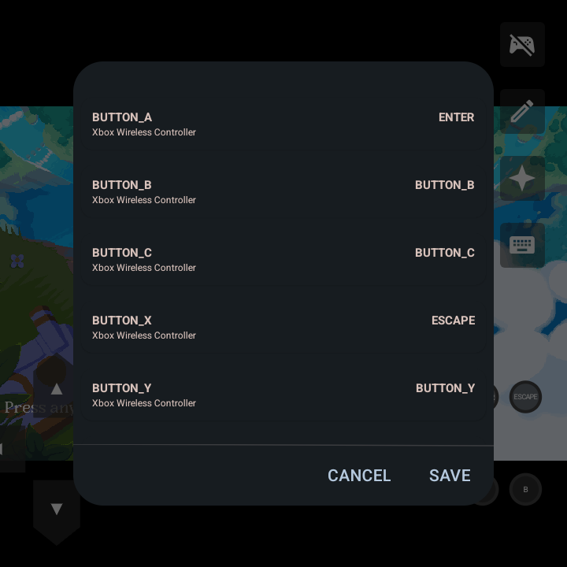

# joiplay-input-detector for JoiPlay

_(specifically, the RG ROTATE)_

A self-contained runtime shim that detects and produces a mapping table for the controller inputs for [JoiPlay](https://github.com/joiplay) games, under Android. _No game content is copied or rewritten._

> You **must** own your game.
>
> Backup your saves is a _should do_.

_supports_:

- maybe Construct
- and/or maybe RPGMaker MZ
- and/or maybe Goot3/4

## Why this shim

It's just time-consuming to map key of the device's controller inputs to the game's expecting controller inputs.




## Get it to work

### Install the CLI

```bash
pnpm install
pnpm input-on
# or yarn, npm, npx, whatever you were using.
# This is under node.js with additional package adm-zip
```

### List existing profiles

```bash
joiplay-input list
```

### Verify

> For a game, verify the `keymap.json` that would be generated for a listed profile

```bash
joiplay-input verify [game-dir] [options: --profile] #default: rg-rotate
```

### Install

> Produces a ready-to-drop `patch-input.rga` having, probably, euhm, the keymap needed for a game.

```bash
joiplay-input install [game-dir] [options: --dry-run, --profile]
```

### Remove produced game patch

> Delete only files this tool created
>
> This don't remove the patch you applied to your game, this just cleans up the patch it produces (if it ever does that through `install`)

```bash
joiplay-inout remove [game-dir]
```

### Patch

1. `patch_input.rga` is produced in a sibling `[game-dir]_patch/` directory.
2. You copy this patch to the device along with your _own_ copy of the game.
3. Add your _own_ game via JoiPlay.
4. Long press the game shorcut -> Patch with RGA.
5. Locate your .rga patch then hit OK.

### How this shims

> Delivers a `.rga` patch.

`.rga` is JoiPlay's own game-archive format (see [github.com/joiplay/rga](https://github.com/joiplay/rga)). This `patch_input.rga` contains a single file `keymap.json`.

JoiPlay reads a **`keymap.json` from the game folder** and remaps physical controller buttons to keyboard keycodes before the game sees them.

```json
    [
      { "button": 19, "keycode": 51, "device": "retrogame_joypad" },
      ...
    ]
```

- `button` - the Android keycode the **device reports**
- `keycode` - the Android keycode the **game receives**
- `device` - input device name; on the RG Rotate this is `retrogame_joypad`

## Upcmoing: scan a game's controls and recommend its mapping

The current profiles were produced by hand. I need to add an evidence-first scanner that answers two separate questions:

1. Which keyboard and native controller inputs does this game actually bind?
2. Given the RG Rotate button table and JoiPlay's limitations, what is the smallest useful `keymap.json` mapping?

The scanner must not claim that finding a word such as `jump` proves a binding.

Every result needs a source file, location or symbol, engine interpretation, and confidence. It produces a report first; installing the proposed mapping is a later, explicit command.
