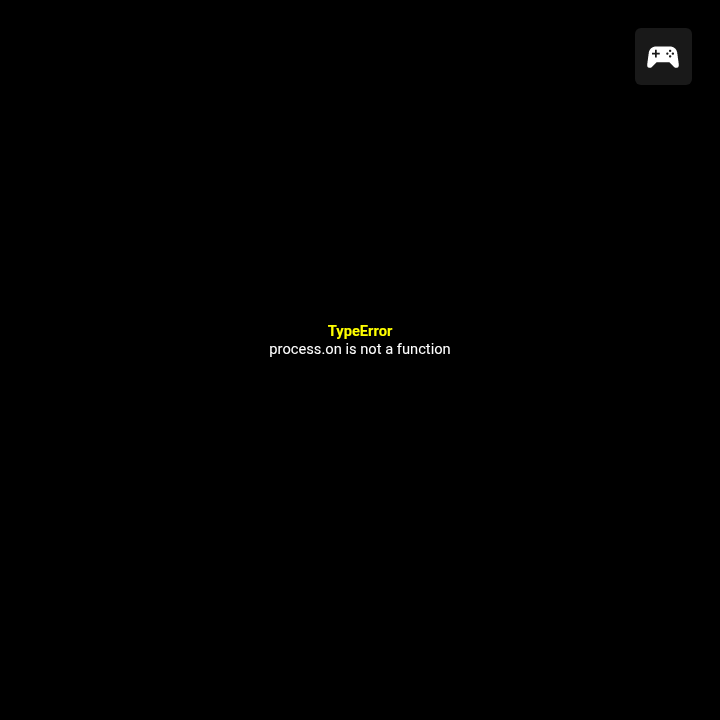

# nwjs-shim for JoiPlay

A self-contained runtime shim that makes NW.js game exports, run under [JoiPlay](https://github.com/joiplay) under Android. _No game content is copied or rewritten._

> You **must** own your game.
>
> Backup your saves is a _should do_.

_supports_:

- maybe Construct
- and/or maybe RPGMaker MZ

## Why this shim

### Games made with RPGMaker MZ.



On desktop the game runs under NW.js = Chromium + Nodejs, where `process` is a real Node-object.

> JoiPlay provides working `fs`, `path`, `process.cwd()`, `process.platform`, etc. -> A functioning filesystem bridge. `process` just happen to not land on the `on`, in some games, to which I believe because of scripts orders

### Games made with Construct (and more likely under Steam)


## Get it to work

### Install the CLI

```bash
cd /path/to/joiplay.tools
pnpm install
# or yarn, npm, npx, whatever you were using.
# This is under node.js with additional package adm-zip and ffmpeg
pnpm --filter nwjs-joiplay-patch-shim run shim-on
```

> pnpm install downloads platform-specific FFmpeg and FFprobe binaries into the workspace. It does not install system-wide FFmpeg.
> The preparation command uses these bundled binaries.

### Detect (you can skip)

```bash
joiplay-shim detect [game-dir]
```

### Shim (will detect as well)

```bash
joiplay-shim install [game-dir] [options: --dry-run]
```

### Verify

> Are the shim files present and consistent

```bash
joiplay-shim verify [game-dir]
```

### Remove produced game patch

> Delete only files this tool created
>
> This don't remove the patch you applied to your game, this just cleans up the patch it produces (if it ever does that through `install`)

```bash
joiplay-shim remove [game-dir]
```

### Patch

1. `patch.rga` is produced in a sibling `[game-dir]_patch/` directory.
2. You copy this patch to the device along with your _own_ copy of the game.
3. Add your _own_ game via JoiPlay.
4. Long press the game shorcut -> Patch with RGA.
5. Locate your .rga patch then hit OK.

## How this shims

> Delivers a `.rga` patch.

`.rga` is JoiPlay's own game-archive format (see [github.com/joiplay/rga](https://github.com/joiplay/rga)): a **zip** containing game files plus a `game.cfg` manifest. Its documented parameters are `title`, `id`, `execFile`, `icon`, `version`, `type` \_\_ where `type` is one of `html`, `renpy`, `rpgmmv`, `rpgmvx`, `rpgmvxace`, `rpgmxp`, `tyrano`, `construct`, `rgpmmz`.

JoiPlay _applies patch_ for NW.js game by unzupping an `.rga` over the game folder. `.rga` patch contains `patches.json` read by JoiPlay. It provides a string table lookup so JoiPlay can apply string replacements to every text files it serves, before WebView parses it.

**Pure addition is this patcher/shim**: `game.cfg` + `patches.json` (+ `shim.js` when new code is needed), delivered as one `.rga` patch. No game file is renamed, no `package.json` edited, no entry HTML overwritten. Uninstall is deleting those files. Steam's "verify integrity" is unaffected, because nothing it tracks has changed. It survives game updates, because it matches strings rather than pinning file hashes.

## Construct worker/ImageBitmap bridge producing sound and not visual videos

1. Construct is hosted in a worker.
2. The video element lives on the DOM side.
3. Construct must transfer frames with `requestVideoFrameCallback` and/or `createImageBitmap(video)`.
4. The WebView accepts the file's metadata and audio but produces no usable image for the transfer path.

RPG Maker video, ordinary DOM `<video>`, Godot's native video decoder, and a GameMaker Android runner use different paths. DON't infer that they fail just because Construct does.

### Step 1: Scan media

> Find real video streams, distinguish a risky asset from hundreds of audio-only `.webm` files

```bash
joiplay-shim scan-media [game-dir]
```

### Step 2: Prepare media

> requires ffmpeg,
> build the patch `_decoded_assets.rga`.

```bash
joiplay-shim prepare-media [game-dir] --report-path [report-path-produced-by-step-1]
```

### Step 3: Install

1. Apply patch to game: `_decoded_assets.rga`
2. Produce if never done it before, shim for game:

```bash
joiplay-shim install [game-dir]
```

3. Apply if never done it before, shim for game: `[gamedir]_patch/patch.rga`

4. Restart JoiPlay, launch game, hope it works.
